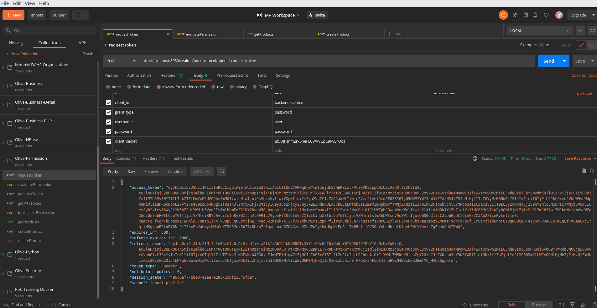
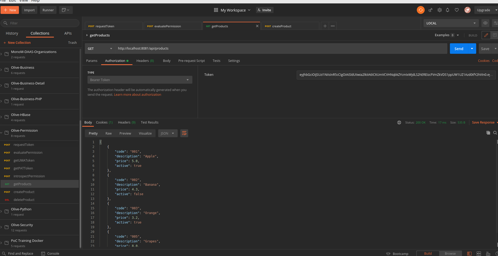
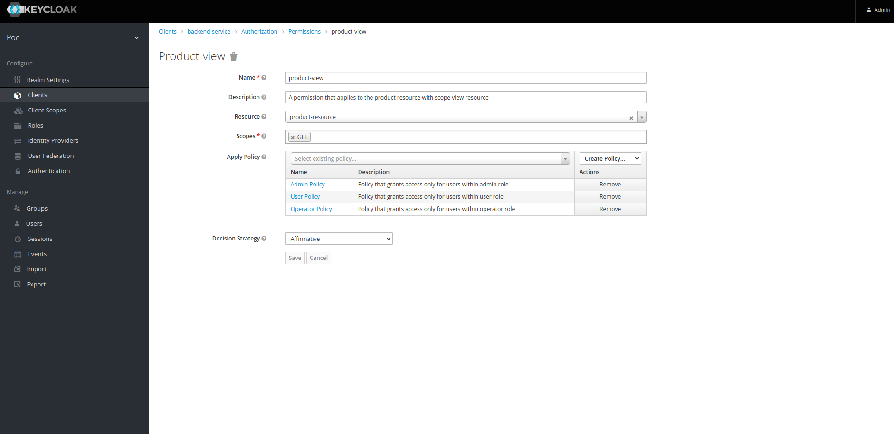
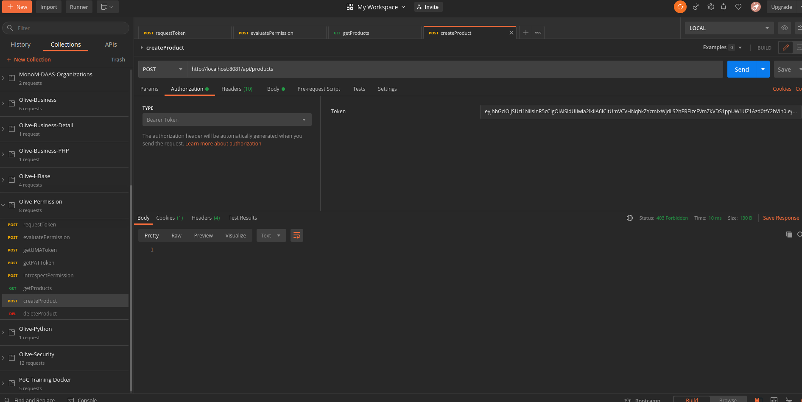
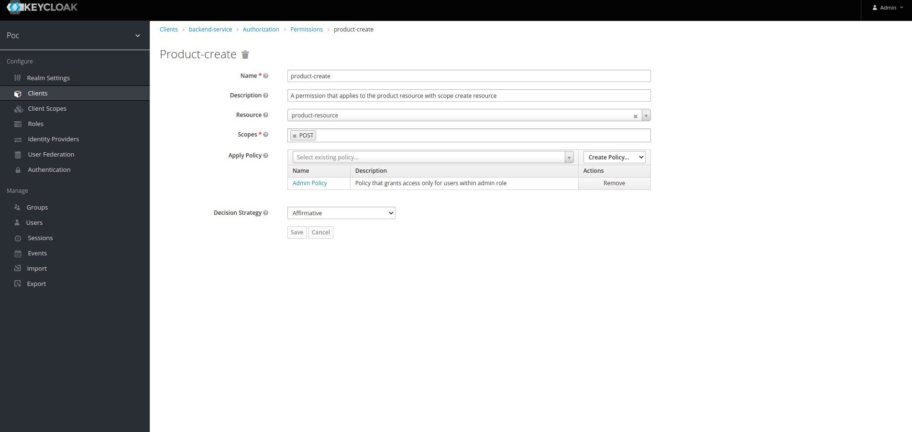

# poc-olive-business-permission
Poc Keycloak Business Authorization Permissions Microservice

## Start IAM

Start keycloak service

```shell
docker run -p 8080:8080 --name keycloak-17 -e KEYCLOAK_ADMIN=admin -e KEYCLOAK_ADMIN_PASSWORD=password quay.io/keycloak/keycloak:17.0.1 start-dev
```

Import realms from export files

## Test service

We could test the service using the users, group and roles and permissions created for the product resource

Login with a default realm **identity**: admin, operator or user with **password**: password



Test get products with the token obtained in the login with **user** identity.
We obtain a list of products because the user has permission under GET /api/products



Theses are the Get Products permissions



Test create product with the token obtained in the login with **user** identity
We obtainer a 403 forbbide because the user not has permission to execute POST /api/products



Theses are the Create Product permissions

